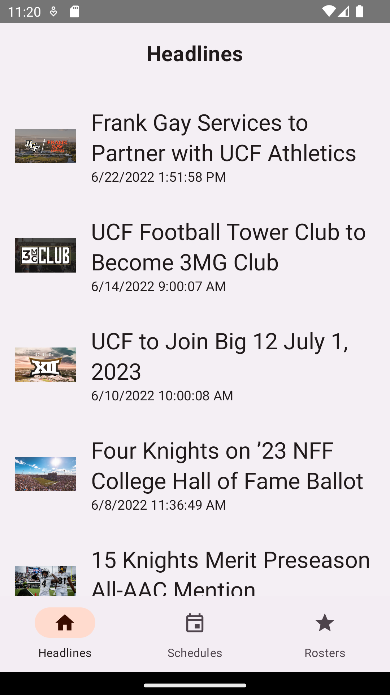
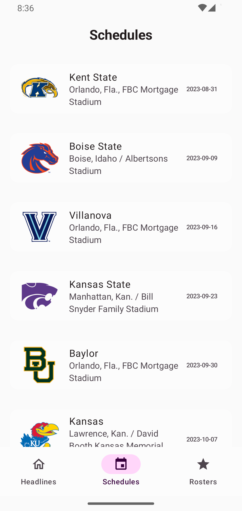
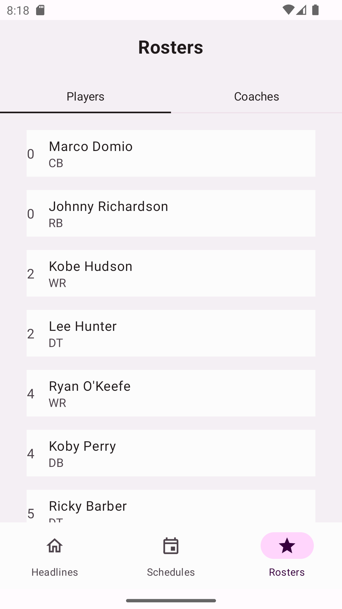

KnightsFootball Android App [Work in progress 🚧]
==================

KnightsFootball is a fully functional Android app built entirely with Kotlin and Jetpack Compose.

The app is currently in early stage development and is not yet available on the Play Store.

## Screenshots

# Architecture

The KnightsFootball app follows the
[official architecture guidance](https://developer.android.com/topic/architecture)

# Modularization

The KnightsFootball app has been fully modularized
